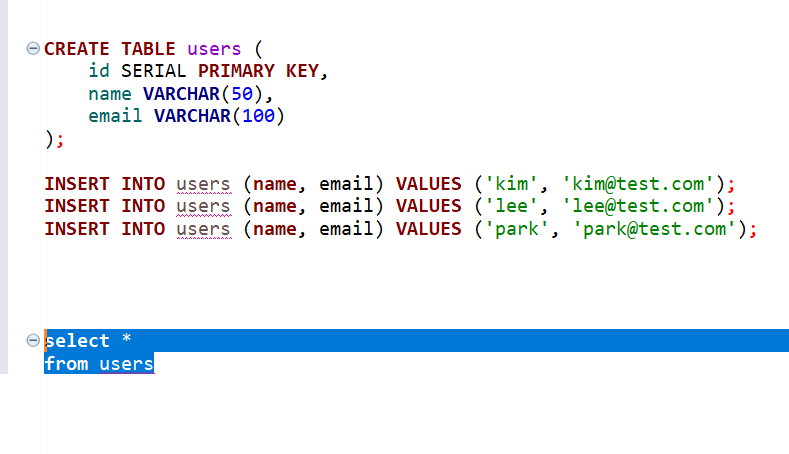

Db Test

```commandline
# PostgreSQL 컨테이너 실행
docker run -d \
  --name pg-test \
  -e POSTGRES_USER=testuser \
  -e POSTGRES_PASSWORD=testpass \
  -e POSTGRES_DB=testdb \
  -p 5432:5432 \
  postgres:16

# 컨테이너 확인
docker ps
```

```commandline
docker exec -it pg-test psql -U testuser -d testdb -c "
CREATE TABLE users (
    id SERIAL PRIMARY KEY,
    name VARCHAR(50),
    email VARCHAR(100)
);
INSERT INTO users (name, email) VALUES ('kim', 'kim@test.com');
INSERT INTO users (name, email) VALUES ('lee', 'lee@test.com');
INSERT INTO users (name, email) VALUES ('park', 'park@test.com');
"
```



