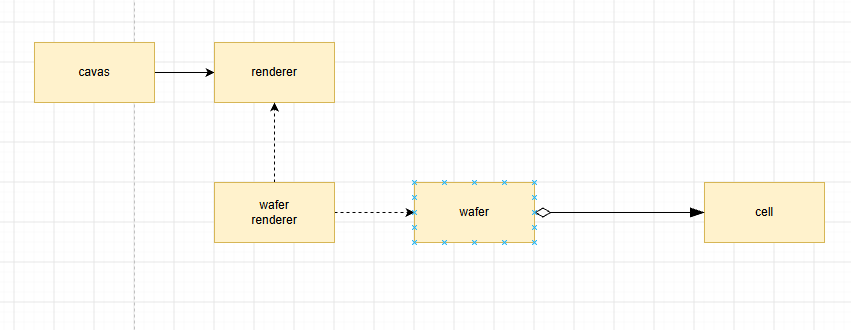

# GPU Render Server

```commandline
 docker-compose -f deploy/gpu/docker-compose.yml up --build          
 docker-compose -f deploy/gpu/docker-compose.yml down                

```

cCanvas -> cRenderer <---- cWaferRenderer




https://app.diagrams.net/#G1Enzqq07T-BQjr0GoS5rM1tieKvBO_FPx#%7B%22pageId%22%3A%22-sNdg_F01_-vaCWDFpgA%22%7D


