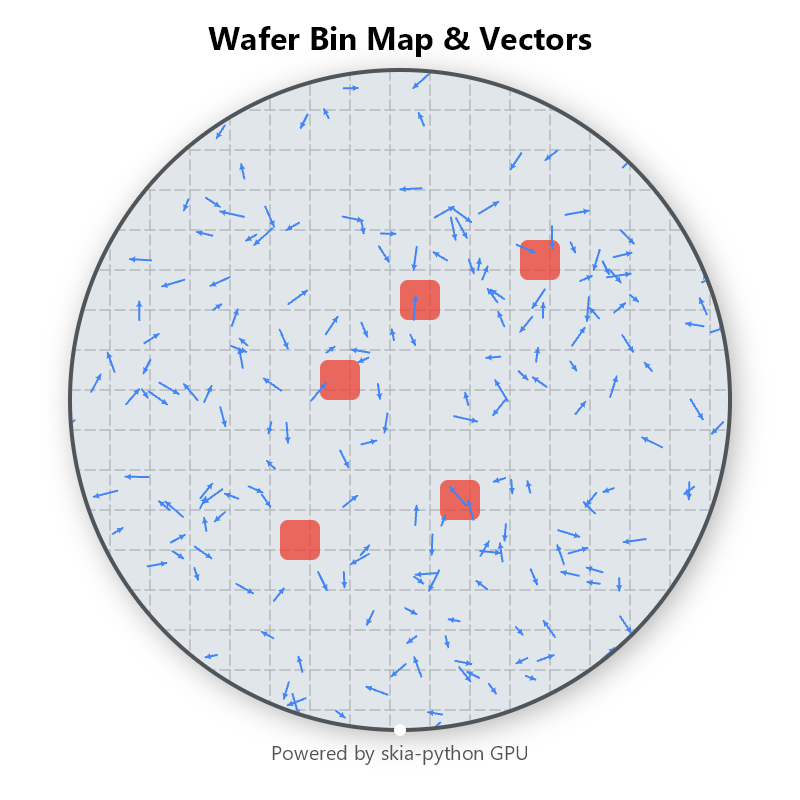
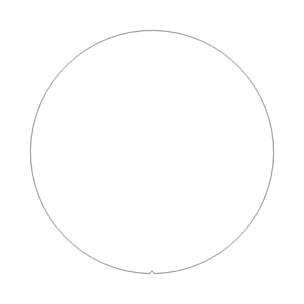

# GPU Render Server

Skia + OpenGL 기반 GPU 가속 2D 이미지 렌더링 서버.  
RTX GPU에서 도형을 그리고, REST API로 클라이언트에 결과 이미지를 전달합니다.

## 아키텍처

```
Client ──POST /render (JSON)──→ FastAPI ──→ Skia Canvas (GPU) ──→ RTX GPU
                                                                     │
Client ←──── image bytes ←──── Pillow ←──── numpy ←──── makeImageSnapshot
```

**렌더링 흐름 (begin → draw → finish)**

```
begin()          GPU에 빈 캔버스(Surface) 생성
  circle(...)    GPU 명령 큐에 "원 그려" 추가
  arrow(...)     GPU 명령 큐에 "화살표 그려" 추가
  text(...)      GPU 명령 큐에 "텍스트 그려" 추가
finish()         GPU 명령 일괄 실행 → 픽셀을 CPU로 복사 → PIL Image 반환
```

## 핵심 기술

| 구성요소 | 역할 |
|---------|------|
| **Skia (skia-python)** | Google의 2D 그래픽 엔진. Chrome, Android, Flutter가 사용. 원/선/화살표/텍스트 등 도형 API 내장 |
| **OpenGL + GLFW/EGL** | GPU 컨텍스트 생성. 데스크탑은 GLFW, 서버는 EGL headless |
| **FastAPI** | 비동기 REST API 서버 |
| **Pillow** | 렌더링 결과 PNG/JPEG/WebP 인코딩 |

## GPU 컨텍스트 생성 순서

Skia GPU를 사용하려면 먼저 OpenGL 컨텍스트가 활성화되어 있어야 합니다.  
`GPURenderer`는 초기화 시 아래 순서로 자동 시도합니다:

1. **GLFW** — 데스크탑 환경 (숨긴 윈도우로 GL context 생성)
2. **EGL** — headless 서버 환경 (모니터 불필요, `moderngl` 사용)
3. **GLX** — X11 환경
4. **CPU 폴백** — 전부 실패 시 소프트웨어 렌더링

## 요구사항

- Python 3.11+
- NVIDIA RTX GPU + 드라이버 535+ (GPU 가속 시)

### 시스템 패키지 (Ubuntu/Debian)

```bash
sudo apt install libfontconfig1 libgl1-mesa-glx libgl1-mesa-egl libegl1 libglvnd0 libgl1-mesa-dri
```

### Windows

NVIDIA 드라이버가 설치되어 있으면 추가 설정 없이 동작합니다.

## 설치 및 실행

```bash
# Python 의존성
pip install -r requirements.txt

# 서버 시작
python server.py
# → http://localhost:8000
```

### Docker 실행

```bash
docker build -t gpu-render-server .
docker run --gpus all -p 8000:8000 gpu-render-server
```

## Python 라이브러리로 직접 사용

```python
from Render.renderer import GPURenderer, Colors

renderer = GPURenderer(width=800, height=600)

renderer.begin()
renderer.clear(Colors.BLACK)
renderer.circle(400, 300, 100, fill=Colors.BLUE)
renderer.arrow(100, 400, 600, 400, color=Colors.GREEN, head_size=20)
renderer.rect(500, 100, 200, 150, fill=Colors.YELLOW, corner_radius=16)
renderer.text("Hello GPU!", 300, 550, size=28, color=Colors.WHITE)
result = renderer.finish()

result.save("output.png")
```

## REST API 사용법

### 헬스체크

```bash
curl http://localhost:8000/health
```

```json
{
  "status": "ok",
  "gpu": "Skia GPU (OpenGL/EGL)",
  "max_texture_size": 32768
}
```

### 이미지 렌더링

클라이언트가 드로잉 명령어 리스트를 JSON으로 보내면 서버가 순서대로 실행합니다.

```bash
curl -X POST http://localhost:8000/render \
  -H "Content-Type: application/json" \
  -d '{
    "width": 800,
    "height": 600,
    "commands": [
      {
        "type": "circle",
        "params": {"cx": 200, "cy": 200, "radius": 80},
        "fill": {"r": 66, "g": 133, "b": 244, "a": 255}
      },
      {
        "type": "arrow",
        "params": {"x1": 100, "y1": 400, "x2": 500, "y2": 400, "head_size": 20},
        "color": {"r": 52, "g": 168, "b": 83, "a": 255},
        "stroke_width": 3
      },
      {
        "type": "text",
        "params": {"text": "Hello GPU!", "x": 250, "y": 550, "size": 28},
        "color": {"r": 255, "g": 255, "b": 255, "a": 255}
      }
    ]
  }' --output result.png
```

### Base64 응답 (웹 클라이언트용)

```bash
curl -X POST http://localhost:8000/render/base64 \
  -H "Content-Type: application/json" \
  -d '{"width": 512, "height": 512, "commands": [...]}'
```

## 지원 도형

| type | 설명 | 주요 params |
|------|------|------------|
| `circle` | 원 | `cx`, `cy`, `radius` |
| `line` | 직선 / 점선 | `x1`, `y1`, `x2`, `y2`, `dashed` |
| `arrow` | 화살표 | `x1`, `y1`, `x2`, `y2`, `head_size`, `head_style` |
| `rect` | 사각형 / 둥근 사각형 | `x`, `y`, `w`, `h`, `corner_radius` |
| `arc` | 호 | `cx`, `cy`, `radius_x`, `radius_y`, `start_angle`, `sweep_angle` |
| `path` | 다각형 / 자유 경로 | `points`, `closed` |
| `text` | 텍스트 | `text`, `x`, `y`, `size`, `bold`, `align`, `font_family` |
| `gradient_rect` | 그라디언트 사각형 | `x`, `y`, `w`, `h`, `colors`, `direction` |
| `circle_shadow` | 그림자 원 | `cx`, `cy`, `radius`, `shadow_blur` |

### 색상 지정

각 명령어에서 `fill` (채우기), `stroke` (테두리), `color` (단색) 으로 색상 지정:

```json
{
  "fill": {"r": 66, "g": 133, "b": 244, "a": 255},
  "stroke": {"r": 255, "g": 0, "b": 0, "a": 255},
  "stroke_width": 3
}
```

Python에서는 프리셋 색상 사용 가능:

```python
Colors.RED, Colors.BLUE, Colors.GREEN, Colors.YELLOW,
Colors.PURPLE, Colors.CYAN, Colors.ORANGE, Colors.WHITE, Colors.BLACK
```

또는 Hex:

```python
Color.from_hex("#4285F4")
```

## 테스트

```bash
python test_client.py
```

## 프로젝트 구조

```
gpu-render-server/
├── server.py              # FastAPI 서버 (REST API 엔드포인트)
├── renderer.py            # GPURenderer (Skia + OpenGL GPU 컨텍스트 관리 + 도형 API)
├── test_client.py         # 테스트 / 벤치마크 클라이언트
├── requirements.txt       # Python 의존성
├── Dockerfile             # NVIDIA GPU 컨테이너
├── .gitignore
├── examples/
│   └── skia_shapes_demo.py  # 독립 실행 데모
└── README.md
```
## 샘플 이미지




## 성능 평가
```렌더러: Skia GPU (OpenGL/EGL)
웨이퍼: 6개 × 화살표 10,000개 = 총 60,000개

INFO:Render.renderer:GPU context 생성 성공 (GLFW)
  Wafer #1: 10,000 arrows — 102ms
  Wafer #2: 10,000 arrows — 102ms
  Wafer #3: 10,000 arrows — 101ms
  Wafer #4: 10,000 arrows — 94ms
  Wafer #5: 10,000 arrows — 92ms
  Wafer #6: 10,000 arrows — 93ms

드로잉 총: 584ms
finish() (GPU→CPU 전송 + 인코딩): 190ms
PNG 저장: 104ms

===== 총 소요: 877ms =====
렌더러: Skia GPU (OpenGL/EGL)
저장됨: wafer_map.png
INFO:Render.renderer:Renderer 리소스 해제 완료

종료 코드 0(으)로 완료된 프로세스
```