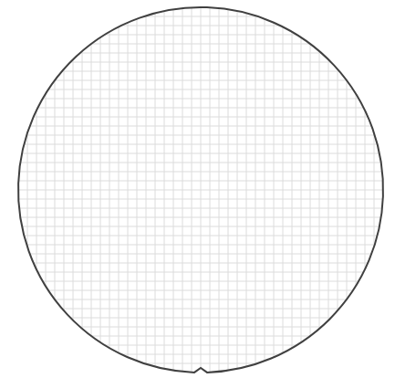

# GPU Render Server

```commandline
 docker-compose -f deploy/gpu/docker-compose.yml up --build          
 docker-compose -f deploy/gpu/docker-compose.yml down                

```

cCanvas -> cRenderer <---- cWaferRenderer


https://app.diagrams.net/#G1Enzqq07T-BQjr0GoS5rM1tieKvBO_FPx#%7B%22pageId%22%3A%22-sNdg_F01_-vaCWDFpgA%22%7D





```

Total 1374.08 ms 1.37 sec 

⏱️ [Wafer Render Pipeline] Grid Render: 6.20 ms
⏱️ [Wafer Render Pipeline] wafer Render 0 0: 569.76 ms
⏱️ [Wafer Render Pipeline] wafer Render 0 1: 21.74 ms
⏱️ [Wafer Render Pipeline] wafer Render 0 2: 21.00 ms
⏱️ [Wafer Render Pipeline] wafer Render 1 0: 22.02 ms
⏱️ [Wafer Render Pipeline] wafer Render 1 1: 33.89 ms
⏱️ [Wafer Render Pipeline] wafer Render 1 2: 23.56 ms
⏱️ [Wafer Render Pipeline] wafer Render 2 0: 23.10 ms
⏱️ [Wafer Render Pipeline] wafer Render 2 1: 22.49 ms
⏱️ [Wafer Render Pipeline] wafer Render 2 2: 23.52 ms
⏱️ [Wafer Render Pipeline] wafer Render 3 0: 22.60 ms
⏱️ [Wafer Render Pipeline] wafer Render 3 1: 23.16 ms
⏱️ [Wafer Render Pipeline] wafer Render 3 2: 24.93 ms
⏱️ [Wafer Render Pipeline] wafer Render 4 0: 21.97 ms
⏱️ [Wafer Render Pipeline] wafer Render 4 1: 39.05 ms
⏱️ [Wafer Render Pipeline] wafer Render 4 2: 22.78 ms
⏱️ [Wafer Render Pipeline] wafer image save: 300.36 ms
========================================
📊 [Wafer Render Pipeline] 전체 요약 (총 소요시간: 1374.08 ms)
  - Grid Render              :    6.20 ms (  0.5%)
  - wafer Render 0 0         :  569.76 ms ( 41.5%)
  - wafer Render 0 1         :   21.74 ms (  1.6%)
  - wafer Render 0 2         :   21.00 ms (  1.5%)
  - wafer Render 1 0         :   22.02 ms (  1.6%)
  - wafer Render 1 1         :   33.89 ms (  2.5%)
  - wafer Render 1 2         :   23.56 ms (  1.7%)
  - wafer Render 2 0         :   23.10 ms (  1.7%)
  - wafer Render 2 1         :   22.49 ms (  1.6%)
  - wafer Render 2 2         :   23.52 ms (  1.7%)
  - wafer Render 3 0         :   22.60 ms (  1.6%)
  - wafer Render 3 1         :   23.16 ms (  1.7%)
  - wafer Render 3 2         :   24.93 ms (  1.8%)
  - wafer Render 4 0         :   21.97 ms (  1.6%)
  - wafer Render 4 1         :   39.05 ms (  2.8%)
  - wafer Render 4 2         :   22.78 ms (  1.7%)
  - wafer image save         :  300.36 ms ( 21.9%)
========================================
```